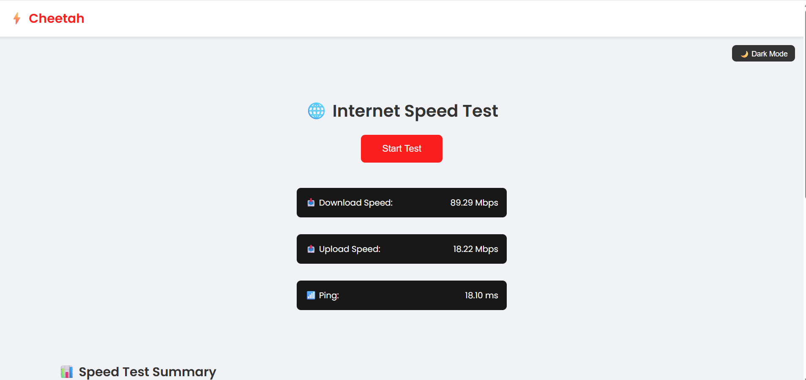
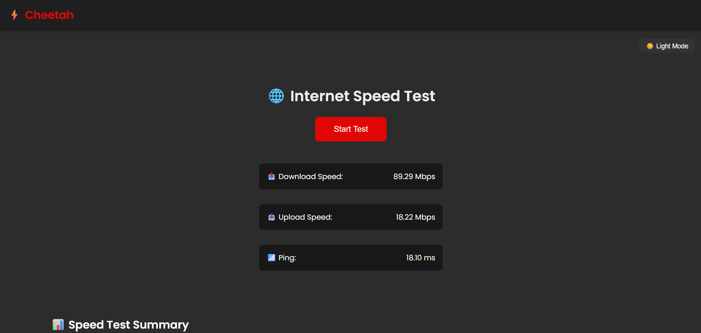

# ⚡ Cheetah – Internet Speed Tester

Cheetah is a sleek, web-based internet speed testing app that measures your **download speed**, **upload speed**, and **ping** — all in one click! 🐆  
It also stores your speed test results in **local history** and visualizes them with clean, interactive **charts**.


---

## 🚀 Features

- 📥 Download, 📤 Upload, and 📶 Ping measurement
- 🕒 History of previous test results
- 📊 Line charts showing trends over time
- 🌙 Light / Dark mode toggle
- 💾 LocalStorage-based saving (MongoDB support also added)
- 🎨 Responsive & modern UI

---

## 🛠️ Tech Stack

**Frontend:**
- React.js
- CSS3
- Recharts 

**Backend:**
- Node.js + Express
- MongoDB (with Mongoose)

---

## 📷 Screenshots

| Light Mode | Dark Mode |
|------------|-----------|
|  |  |
---

## 📦 Installation

### 1. Clone the repository
```bash
git clone https://github.com/Nilakshi29/Cheetah-speed-test
cd cheetah-speed-test
```

### 2. Install dependencies

- For CLIENT
```bash
cd client
npm install
```

- For SERVER

```bash
cd server
npm install
```

- This will install all the necessary dependencies for the project.

---

### 3. Create .env in /server

```env
PORT=5000
MONGO_URI=your_mongodb_connection_string
```

### 4. Run the app

First start the server(backend) and then the client

- Start the Backend

```bash
cd server
node index.js
```

- Start the frontend 
Open new Terminal and run: 

```bash
cd client
npm start
```
Then visit the given link to run the project properly.

## Author

Made with ❤️ by Nilakshi 

Feel free to connect: 
[LinkedIn](https://www.linkedin.com/in/nilakshi-shree)
[GitHub](https://github.com/Nilakshi29)


